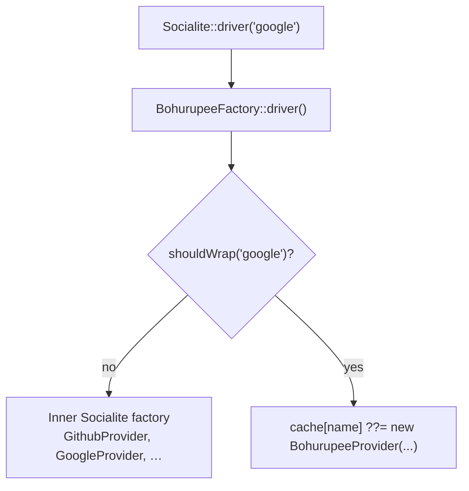
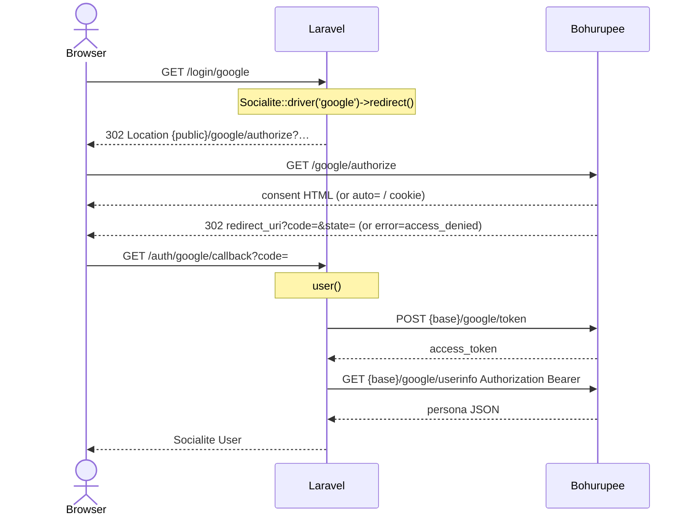
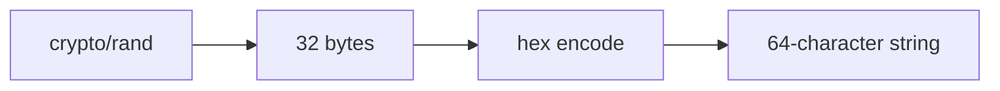
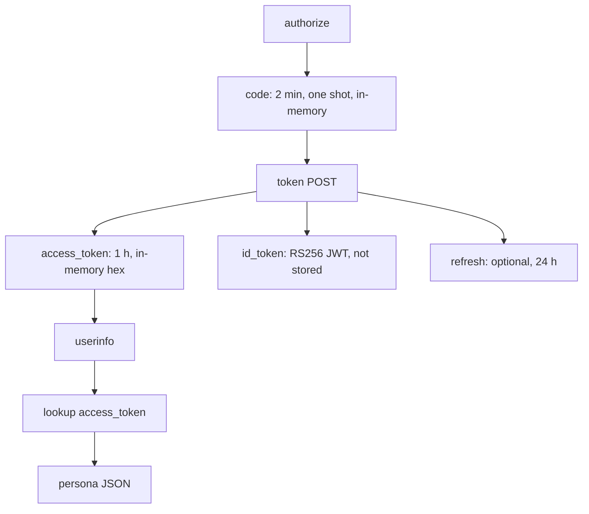

# How the Laravel adapter works

This is the internals of [`milon/bohurupee-laravel`](https://packagist.org/packages/milon/bohurupee-laravel).
Install and env vars are on [Laravel Socialite](socialite.md). The Go server
is a separate process; this package never embeds it.

The adapter does **not** add routes, change `config/services.php`, or
implement OAuth itself. It replaces Socialite's *provider objects* with ones
whose URLs point at Bohurupee. Your `Socialite::driver($name)->redirect()` /
`->user()` code stays the same.

## Classes

| Class                          | Role                                                                          |
|--------------------------------|-------------------------------------------------------------------------------|
| `BohurupeeServiceProvider`     | Merge config, production guard, decorate the Socialite factory                |
| `BohurupeeFactory`             | `Factory` decorator: wrap or pass through `driver($name)`                     |
| `BohurupeeProvider`            | Socialite `AbstractProvider` whose authorize / token / userinfo hit Bohurupee |
| `UserMapper`                   | Userinfo JSON → Socialite getters + `setRaw()`                                |
| `OAuthErrorException`          | Callback `error=` (Deny) instead of a missing-code failure                    |
| `ProductionForbiddenException` | Boot failure when `enabled` in `APP_ENV=production`                           |

Composer auto-discovers the service provider via
`extra.laravel.providers` in the package `composer.json`.

## Boot

`register()` only merges `config/bohurupee.php`. Nothing wraps Socialite yet.

`boot()`:

1. Publishes that config under the `bohurupee-config` tag.
2. If `bohurupee.enabled` is false, return. Native Socialite is unchanged.
3. If `app()->environment('production')`, throw
   `ProductionForbiddenException`. The container never gets a wrapped factory.
4. Otherwise `$this->app->extend(Factory::class, …)` replaces the bound
   Socialite factory with `new BohurupeeFactory($inner, $app)`.

`extend` keeps the original factory as `$inner`. Native Google/GitHub classes
still exist; they are just not returned for wrapped names.

## `driver($name)`



`shouldWrap`:

1. If `$name` is in `bohurupee.except`, never wrap.
2. If `bohurupee.drivers` is empty, wrap **every** name, including slugs
   Socialite has no built-in class for (`acme`, `jumpcloud`).
3. If the list is non-empty, wrap only those names.

Instances are memoized on the factory (`$this->drivers[$name]`). The inner
factory is still used for `getDefaultDriver()` and any other method via
`__call`.

Construction reads `config('services.'.$name)` the same way Socialite would:

| Constructor arg | Source                                                   |
|-----------------|----------------------------------------------------------|
| `$clientId`     | `services.{name}.client_id`, else `bohurupee-{name}`     |
| `$clientSecret` | `services.{name}.client_secret`, else `bohurupee`        |
| `$redirectUrl`  | `services.{name}.redirect`, else `/auth/{name}/callback` |
| `$slug`         | the Socialite driver name                                |
| `$baseUrl`      | `bohurupee.url` (token + userinfo, Guzzle)               |
| `$publicUrl`    | `bohurupee.public_url` (browser authorize redirect)      |

A relative redirect (`/auth/google/callback`) is turned into an absolute URL
with `$app['url']->to(...)`. That matches Socialite's own behaviour so the
session cookie set on `redirect()` is still sent on the callback. An already
absolute `redirect` is left alone.

## Two origins

Authorize is a **browser** redirect. Token and userinfo are **server-side**
HTTP from PHP.

When Laravel and Bohurupee share localhost, both URLs are
`http://127.0.0.1:4190`. In Docker they differ:

| Config                 | Who uses it                             | Example                  |
|------------------------|-----------------------------------------|--------------------------|
| `bohurupee.url`        | Guzzle `POST …/token`, `GET …/userinfo` | `http://bohurupee:4190`  |
| `bohurupee.public_url` | Location of `redirect()`                | `http://127.0.0.1:14190` |

`BohurupeeProvider` builds:

- authorize: `{publicUrl}/{slug}/authorize`
- token: `{baseUrl}/{slug}/token`
- userinfo: `{baseUrl}/{slug}/userinfo`

The slug is the Socialite driver name. `Socialite::driver('github')` talks to
`/github/…` on Bohurupee, not to github.com.

## What `AbstractProvider` still does

`BohurupeeProvider` extends Laravel Socialite's `Two\AbstractProvider`. The
parent owns the authorization-code machinery:

- `redirect()` stores `state` (unless `stateless()`), builds the authorize
  query (`client_id`, `redirect_uri`, `response_type=code`, `scope`,
  `state`, PKCE when enabled).
- `user()` (parent) reads `code` from the callback, checks `state`,
  `POST`s the token URL with `grant_type=authorization_code`, then calls
  `getUserByToken($accessToken)`.

The subclass only supplies URLs, default scopes (`openid profile email`,
space-separated), userinfo fetch, mapping, and the Deny short-circuit.

It does **not** call OIDC discovery or verify `id_token`. Socialite's OAuth2
path is code → access token → userinfo. Bohurupee may still issue an
`id_token` on the token response; the adapter ignores it.

## Redirect → consent → callback



Bohurupee is an open local client: the token endpoint accepts the
`client_id` / `client_secret` Socialite sends and does not validate them
against a registry. How those strings are minted is below.

## How the binary issues tokens

The Laravel adapter never creates tokens. `POST {base}/{slug}/token` is
handled by the Go process (`internal/oauth.Store` and `internal/oidc.Signer`).
There is no database. Everything except the OIDC signing key lives in process
memory and disappears when `bohurupee` exits.

### Opaque strings, not JWTs (except `id_token`)

Authorization codes, access tokens, and refresh tokens are the same shape:



They are **lookup keys**, not signed objects. Userinfo does not parse the
bearer token; it looks it up in a map. The only JWT is `id_token`.

### Authorization code

On a successful authorize (persona picked, `auto=`, or `loginAs` cookie),
`Store.IssueCode` records a grant keyed by the random code:

| Stored with the code    | Why                                                                                |
|-------------------------|------------------------------------------------------------------------------------|
| provider slug           | Token URL must match `/google/token` if the code was issued on `/google/authorize` |
| `client_id`             | Must match the token request                                                       |
| `redirect_uri`          | Must match authorize **and** token (RFC 6749)                                      |
| persona id              | Who the access token will represent                                                |
| PKCE challenge + method | Verified if a challenge was sent                                                   |
| `scope`, `nonce`        | Copied onto the token response / `id_token`                                        |
| expiry                  | **2 minutes** (`DefaultCodeTTL`)                                                   |
| used flag               | Single use                                                                         |

The browser never sees the grant, only `redirect_uri?code=&state=`.

### Code → access token

`POST /{provider}/token` with `grant_type=authorization_code`:

1. Read `client_id` from HTTP Basic or the form. The secret is accepted and
   **not** checked (open local client).
2. Look up the code. Fail with `invalid_grant` if missing, already used,
   expired, or if provider / `client_id` / `redirect_uri` disagree.
3. If the grant stored a PKCE challenge, require `code_verifier`.
   `S256` is SHA-256 of the verifier, Base64URL without padding, compared to
   the challenge. `plain` is a string match.
4. Delete the code (single use) and call `issueTokensLocked`.

`issueTokensLocked` draws another 32-byte hex string and stores:

```text
access_token → { provider, personaID, expiresAt = now + 1 hour }
```

JSON:

```json
{
  "access_token": "<64 hex chars>",
  "token_type": "Bearer",
  "expires_in": 3600,
  "scope": "openid profile email"
}
```

`refresh_token` is included only when YAML `refreshTokens: true` (off by
default). That grant lasts **24 hours** and is also opaque hex. A refresh
request mints a **new** access token and returns the **same** refresh token.

### `id_token` (JWT)

Issued on the token response when:

- `idToken: always`, or
- the grant's scope contains `openid` (default `idToken: openid`), or
- the provider profile sets `protocol.id_token: true` (Apple).

It is **not** stored. `oidc.Signer` builds a JWT and signs it RS256 with
`github.com/lestrrat-go/jwx/v3`.

Key material: `LoadOrCreate` reads `…/bohurupee/oidc.key` under the user
config directory (PKCS#1 PEM, mode `0600`). Missing file → generate a 2048-bit
RSA key and write it. Restarting the binary keeps the same `kid` so previously
issued `id_token`s still verify against `/{provider}/jwks`.

Claims:

| Claim                                                                                 | Value                                                          |
|---------------------------------------------------------------------------------------|----------------------------------------------------------------|
| `iss`                                                                                 | `{display URL}/{provider}`                                     |
| `sub`                                                                                 | `{provider}:{persona}` (same as userinfo `id`)                 |
| `aud`                                                                                 | `client_id` from the grant                                     |
| `iat` / `exp`                                                                         | now / now + access-token TTL (1 hour)                          |
| `email`, `email_verified`, `name`, `given_name`, `family_name`, `nickname`, `picture` | persona                                                        |
| `nonce`                                                                               | from authorize, if sent                                        |
| `at_hash`                                                                             | left half of SHA-256 of the **access token**, Base64URL (OIDC) |
| extra                                                                                 | persona YAML `claims:`, except reserved JWT names              |

The Laravel adapter **does not read** `id_token`. Socialite uses the access
token + userinfo. OIDC clients (Auth.js, the Python example) verify the JWT
against JWKS.

### Userinfo

`GET /{provider}/userinfo` with `Authorization: Bearer {access_token}`:

1. `Store.LookupToken` — unknown, expired, or wrong provider → `401`.
2. Load that persona from the YAML catalog.
3. `profiles.Render` (generic → template → profile `response` → persona
   overlay). See [Provider profiles](provider-profiles.md).

No new token is created here. The bearer is only a map key.



## `user()` and Deny

`BohurupeeProvider::user()` runs **before** the parent:

```php
if ($this->request->filled('error')) {
    throw OAuthErrorException::fromRequest($this->request, $this->slug);
}
return parent::user();
```

Consent **Deny** redirects to `redirect_uri?error=access_denied&state=…`
with no `code`. Without this check, Socialite would fail as a missing code.

`OAuthErrorException` implements `render()` (Laravel's exception renderer):

| Request                                                | Response                                                                                                                                                                                          |
|--------------------------------------------------------|---------------------------------------------------------------------------------------------------------------------------------------------------------------------------------------------------|
| JSON (`Accept: application/json`, `expectsJson`, ajax) | `400` `{provider, error, error_description, state}`                                                                                                                                               |
| HTML                                                   | redirect to `bohurupee.error_redirect`, else named routes `filament.admin.auth.login`, `login`, else `/login`, with flash keys `bohurupee_oauth_error`, `filament-socialite-login-error`, `error` |

You can still `catch (OAuthErrorException $e)` in the callback.

## Userinfo → Socialite `User`

`getUserByToken` is a GET to `{baseUrl}/{slug}/userinfo` with
`Authorization: Bearer {access_token}` and `Accept: application/json`.
The JSON body is decoded as an array (empty array on failure).

`UserMapper::map()`:

1. `setRaw($raw)` — full payload, including GitHub `login`, claims, overlays.
2. `map([...])` fills getters. First non-empty key wins.

| Getter          | Keys, in order                                                                         |
|-----------------|----------------------------------------------------------------------------------------|
| `getId()`       | `id`, `sub`                                                                            |
| `getEmail()`    | `email`                                                                                |
| `getName()`     | `name`, `display_name`                                                                 |
| `getNickname()` | `nickname`, `login`, `preferred_username`                                              |
| `getAvatar()`   | `picture.data.url`, string `picture`, then `avatar`, `profile_image_url`, `avatar_url` |

Nested `picture.data.url` is Facebook-shaped. String `picture` is Google /
OIDC. The mapper does not know the slug; shape comes from Bohurupee's
[provider profiles](provider-profiles.md).

## What stays native

When the factory does not wrap a name, Socialite's real provider runs:
outbound HTTPS to Google, GitHub, and so on. Use `except` for a driver you
still want live, or leave `enabled` false.

Disabled (`BOHURUPEE_ENABLED` unset/false): the service provider never
calls `extend`. `Socialite::driver('github')` is `GithubProvider`.

## Tests

Package tests bind Orchestra Testbench, enable the adapter, and mock Guzzle.
Redirect assertions check `127.0.0.1:4190/{slug}/authorize` and the absence
of `accounts.google.com` / `github.com`. Token/userinfo tests replay HTTP
and assert those hosts never appear on the wire.
